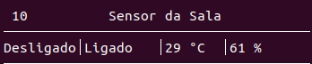
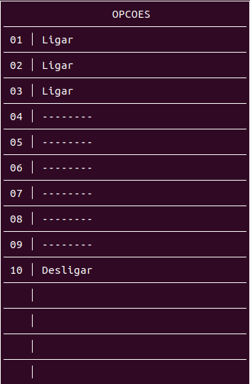

# FSE - Projeto 4

| Aluno | Matrícula |
|-|-|
| Henrique Martins | 17/0050394 |

## Como Executar

### Servidor Central

Entre na pasta `central` e digite o seguinte comando para compilar:

```
make
```

Para executar, digite:

```
./bin/bin
```

### ESP32

Entre na pasta `esp` e digite o seguinte comando:

```
idf.py menuconfig
```

para configurar o seu WiFi.

Em seguida, digite:

```
idf.py build
```

para gerar a build.

Para começar a execução, digite:

```
idf.py -p /dev/ttyUSB0 flash monitor
```

## Observações



- O número no lado esquerdo superior indica o <b>identificador</b> do dispositivo (no exemplo: <b>10</b>)
- O texto ao lado indica o <b>nome</b> do dispositivo (no exemplo: <b>Sensor da Sala</b>)
- O primeiro valor representa a <b>entrada</b> do dispositivo (no exemplo: <b>Desligado</b>)
- O segundo valor representa a <b>saída</b> do dispositivo (no exemplo: <b>Ligado</b>)
- O terceiro valor representa a <b>temperatura</b> (no exemplo: <b>29 °C</b>)
- O quarto valor representa a <b>umidade</b> (no exemplo: <b>61%</b>)
- Conforme novos dispositivos vão sendo adicionados, eles aparecerão na lista de dispositivos



- Ao escolher a opção de mudar o estado de um dispositivo, você poderá mudar aqueles com a opção de <b>Ligar</b> ou <b>Desligar</b>
- Conforme novos dispositivos vão sendo adicionados, eles aparecerão nessa lista